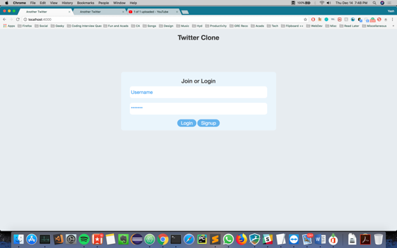
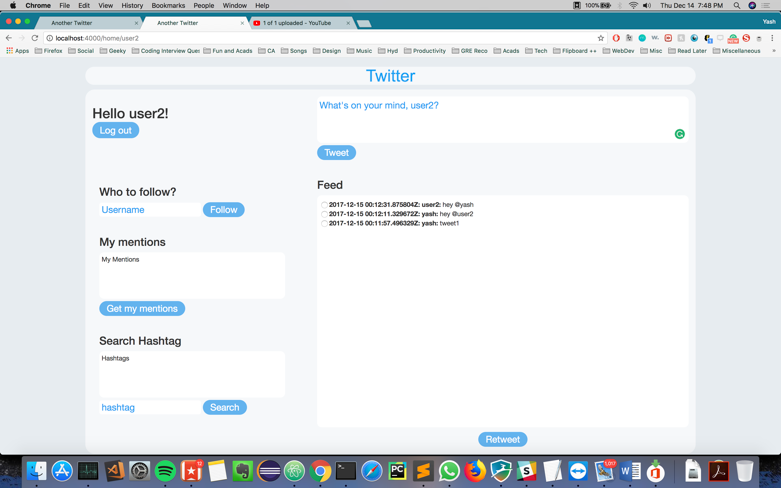
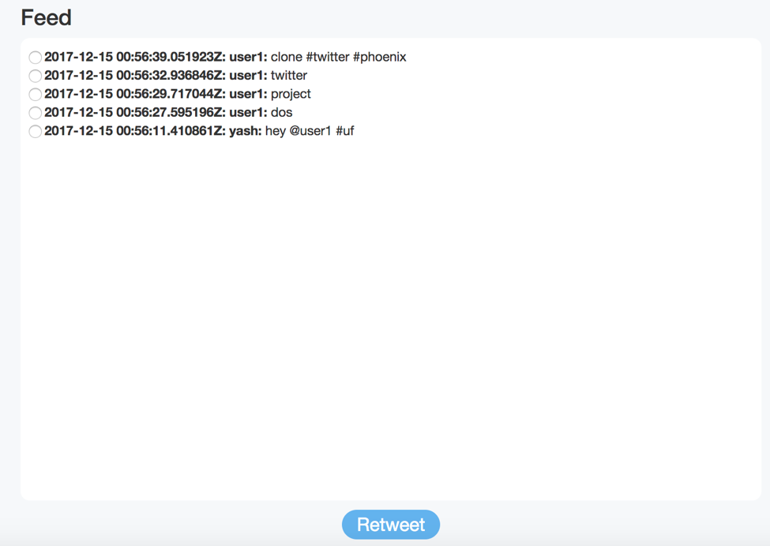
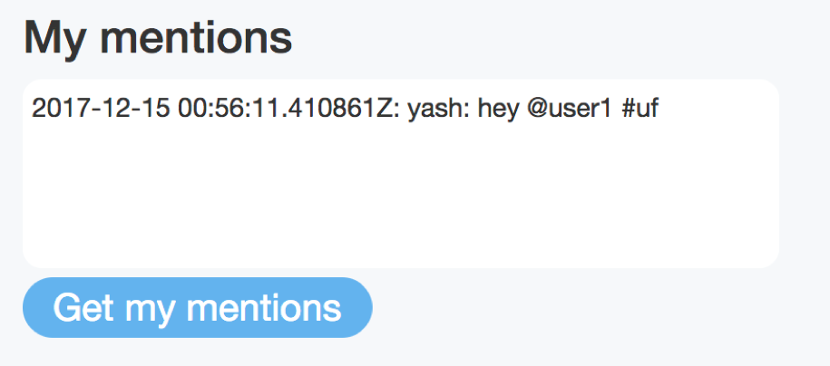

Phoenix Twitter

==============================================================================

DEMO LINK: https://youtu.be/jlELzv7caxI

==============================================================================

These are the instructions of deploying the elixir application on Heroku can be found here: https://hexdocs.pm/phoenix/heroku.html. 
The current app is hosted on https://uftwitter.herokuapp.com/

==============================================================================

1. Creating user
	1. Go to https://uftwitter.herokuapp.com/
	2. Enter the username and password
	3. Click on signup

2. Login
	1. Go to https://uftwitter.herokuapp.com/
	2. Enter the username and password
	3. Click on Login

==============================================================================

After Login:
1. Tweeting
	1. Enter the text in the textbox above Tweet button
	2. Press Enter key or click the Tweet button

2. Follow
	1. Enter the username to follow in the textbox before Follow button
	2. Click on the Follow button

3. My mentions tweets
	1. Click on Get my mentions button
	2. If there are any tweets in which the user was mentioned, it will be displayed

4. Hashtags
	1. Enter the hashtag (eg. for a hashtag #awesome, type awesome)
	2. Click on Search button
	3. If the hashtag has tweets, it will be displayed

5. Retweet
	1. Click on the radio button for the tweet to be retweeted
	2. Click on Retweet button

==============================================================================

Code Info:

The channel being used here is 'twitter'. The client code is in socket.js. Using channel.push, we send the request in JSON format to the TwitterChannel where the calls are handled.The response is sent back using user sockets which is handled in channel.on.

For data storage, ETS has been used. 

Flows:

1. Create User
	1. Username and Password are given from the client to the channel 	"register_account". Channel adds the user to the database based on user exist 		validation.
	2. If user exists, sends an error message to the client else success message in 	"signupres" of socket.js.

2. Sign in
	1.  Username and Password are given from the client to the channel "signin"		and adds the user to the database based on user/password validation.
	2. Redirects to localhost:4000/home/theusername page
	3. User's socket is updated in socketmaps ets table.

3. Tweet
	1. Tweet content is sent to the channel
	2. Channel creates a new tweet and mention list and hashtag list is generated
	3. Tweet is send to all users in following list and mention list and to self.
	4. The response is received in channel.on("gettweet") of the above users and 		appended to div of the user's feed.

4. Retweet
	1. Original tweetid is fetched from radio button of the tweet
	2. The tweet description, id and OP id is sent to the channel
	3. This is marked as retweet and added to database. 
	4. 3. Tweet is send to all users in following list and mention list
	5. The response is received in channel.on("gettweet") of the above users and 		appended to div of the user's feed.

5. Follow
	1. Username to follow is sent to the channel in "follow". 
	2. If user exists, it is followed else error message is sent to the client in 	"followres"

6. Get Mentions
	1. Request to the channel is sent in "getmentions"
	2. Tweets are fetched and sent to client in "getmentions" of socket.js

7. Hashtag query
	1. Hashtag string is sent to the channel in "gethashtag"
	2. Result is sent from hashtag table and sent to client in "gethashtag"

8. Update Feed
	This happens when the user logs in or the page is refreshed
	1. The new socket value of the user is updated in socketmaps ets table
	2. The mentioned tweets, self tweets, following tweets are displayed in the feed

9. Log out
	1. Socket of the user is set to nil
	2. Redirected to home page

==============================================================================

All the tweets are in JSON format. 
eg. %{time: time, tweeter: username, tweetText: desc, isRetweet: true, org: org_user, tweetID: tweetid}

All the messages are also in JSON format.
eg. %{status: "Login failure. Please check username/password."}

==============================================================================

